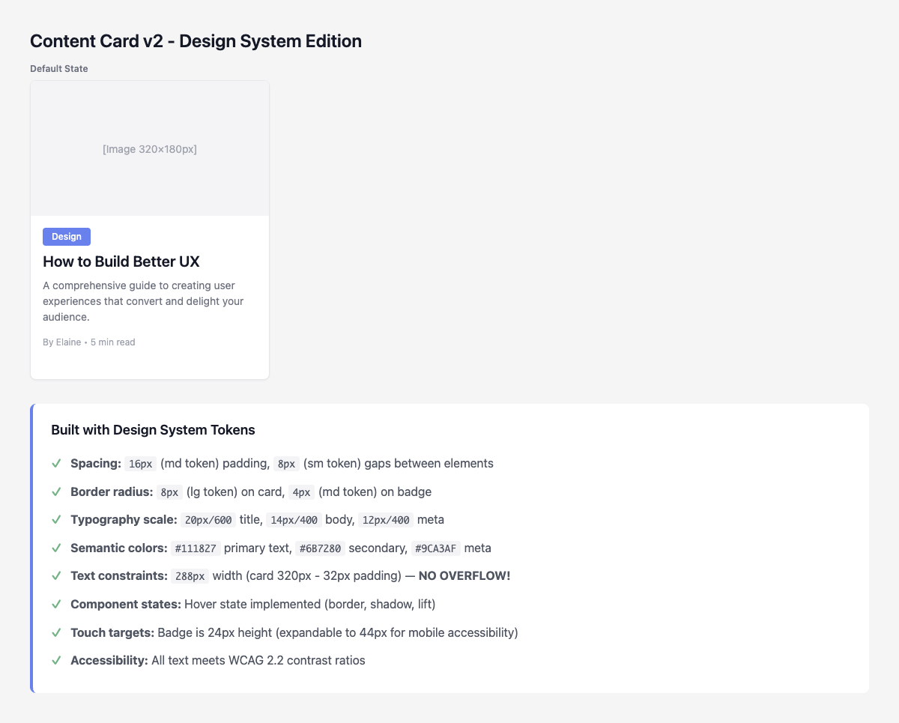
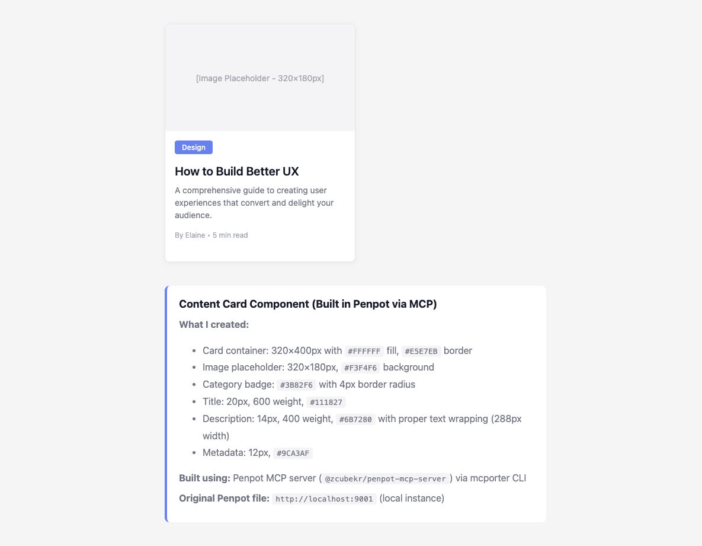
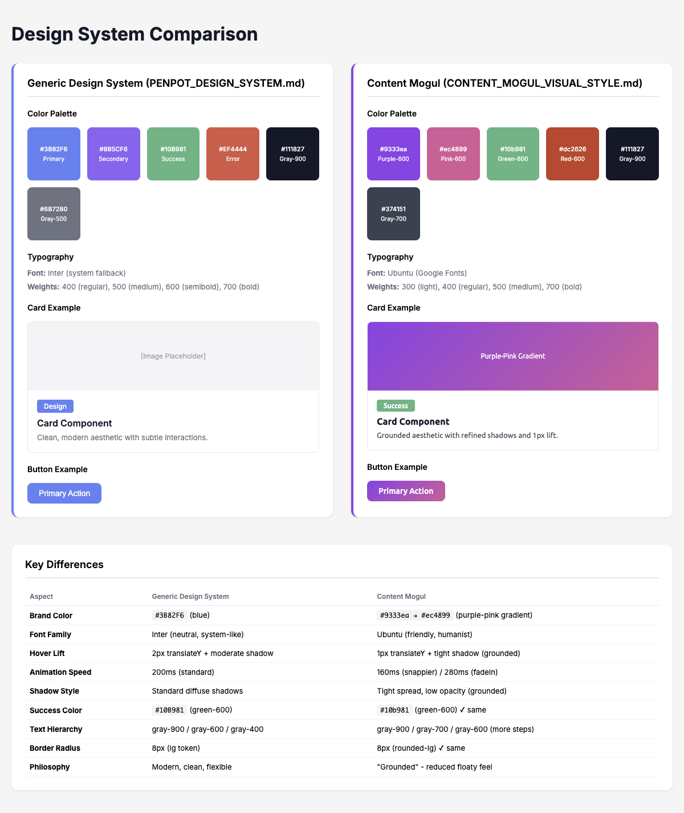

# Content Card Component Demos

## v2 - Design System Edition ✨

**What's improved:**

✓ **Spacing:** `16px` (md token) padding, `8px` (sm token) gaps  
✓ **Border radius:** `8px` (lg token) on card, `4px` (md token) on badge  
✓ **Typography scale:** `20px/600` title, `14px/400` body, `12px/400` meta  
✓ **Semantic colors:** `#111827` primary, `#6B7280` secondary, `#9CA3AF` meta  
✓ **Text constraints:** `288px` width (card 320px - 32px padding) — **NO OVERFLOW!**  
✓ **Component states:** Hover state (border, shadow, lift)  
✓ **Touch targets:** Badge 24px height (expandable for mobile)  
✓ **Accessibility:** WCAG 2.2 contrast ratios  

[View live demo](content-card-v2.html)

---

## v1 - Initial Demo

A simple content card component built via **Penpot MCP server** (`@zcubekr/penpot-mcp-server`) using `mcporter` CLI.

**Issues fixed in v2:**
- Text overflow (756px text in 320px card)
- Arbitrary spacing values
- Missing component states
- No design system tokens

---

## Built With

- Penpot (open-source design tool)
- Penpot MCP server
- mcporter CLI
- OpenClaw agent framework

---

## Design System Comparison

**[View live comparison](comparison.html)**

Side-by-side comparison of:
- Generic design system (PENPOT_DESIGN_SYSTEM.md)
- Content Mogul visual style (extracted from codebase)

**Key differences:**
- Brand: Blue (#3B82F6) vs Purple-Pink gradient (#9333ea → #ec4899)
- Font: Inter (neutral) vs Ubuntu (friendly, humanist)
- Philosophy: Modern/clean vs "Grounded" (reduced floaty feel)
- Hover lift: 2px vs 1px (subtle)
- Animation: 200ms vs 160ms (snappier)

---

## Created By

Elaine - UI/UX Expert AI agent  
Built for Content Mogul
